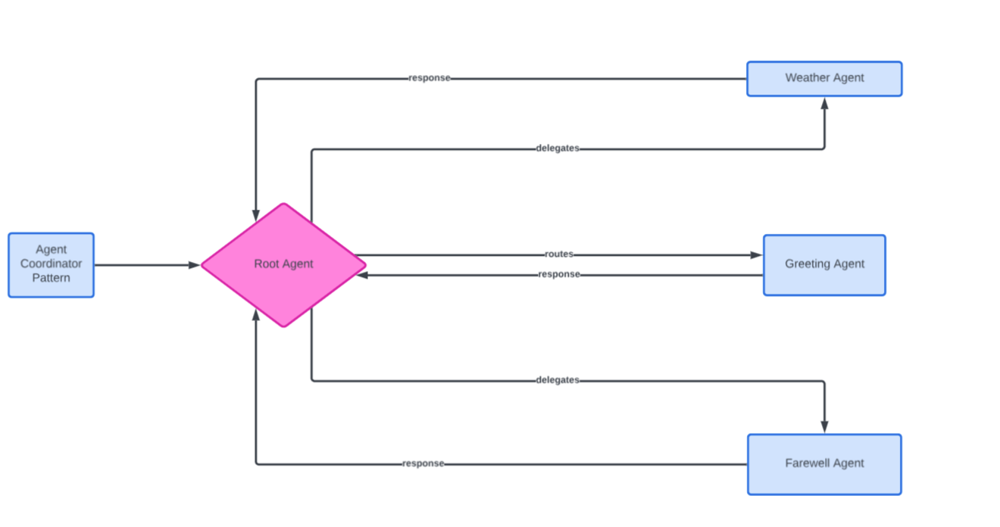

# Google ADK Multi-Agent Application

A multi-agent application demonstrating coordinated AI agents for handling greetings, farewells, and weather requests using the Google ADK framework.



## Setup

Create and activate the Conda environment with Python 3.11:

```bash
conda create -n adkagent python=3.11 -y
conda activate adkagent
```

Install dependencies:

```bash
pip install -r requirements.txt
```

## Running the Application

Start the ADK web interface:

```bash
adk web
```

## Project Structure

```
├── muli_agent/
│   ├── __init__.py       # Package initialization
│   ├── agent.py          # Multi-agent implementation
│   └── test.py           # Model testing script
├── requirements.txt      # Python dependencies
└── README.md             # This file
```

## Features

- **Greeting Agent**: Handles user greetings with personalization
- **Farewell Agent**: Provides polite farewell messages
- **Root Agent**: Coordinates specialized agents and handles weather queries
- **Weather Tool**: Returns weather information for specified cities

## Environment Variables

Make sure to set the following environment variable:

```bash
GOOGLE_API_KEY=your_api_key_here
```

Use a `.env` file in the project root to configure this automatically.


code .
ollama pull llama2
ollama pull gemma2:2b
ollama list
doskey /history
